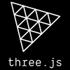

<h1 align="center"> 👋 Hello there </h1>

    Welcome to my Github repo. My name is Fume Uvwie, 
    I'm <strong>Web/Game Developer</strong> and <strong>Motion Designer</strong>. 
    I'm currently on a mission to build visually engaging, interactive, and immersive digital
    experiences on the web through the combination of <em>Code</em>,
    <em>Design</em>, and <em>Animation</em>. I love learning, consistently iterating,
    and experimenting with new technologies. You can check out
    some of my projects and let me know if you like to work
    together.
 

    

 

---

### Things I like to work on

1. Front-End Website Development
   - Blogs
   - Portfolio
   - E-Commerce
   - 3D Website
2. Game Development
   - ThreeJS Games
   - Unity Games
3. Content Creation
   - Motion Graphics
   - Video Editing

### Find me around the web 🕸️:

- Documenting my learning Journey in public on <a href="https://youtube.com/@FumeCreates?si=-IRU-1vCYXoSPjtD">📽️YouTube</a> or <a href="https://dev.to/fumez">✍🏿fumez.dev</a>
- Sharing updates and Interacting on <a href="https://www.linkedin.com/in/fumeuvwie/">LinkedIn</a>

---

### ⚙️ Language and Technologies

    
    
    
    
    
    
    
    

#

### 📦 Packages

    
    

#

### 🔨 Dev tools

    
    
    

#

### 🎨 Design tools

---

### GitHub Stats

<!--
**fumzy123/fumzy123** is a ✨ _special_ ✨ repository because its `README.md` (this file) appears on your GitHub profile.

Here are some ideas to get you started:

- 🔭 I’m currently working on ...
- 🌱 I’m currently learning ...
- 👯 I’m looking to collaborate on ...
- 🤔 I’m looking for help with ...
- 💬 Ask me about ...
- 📫 How to reach me: ...
- 😄 Pronouns: ...
- ⚡ Fun fact: ...
-->
